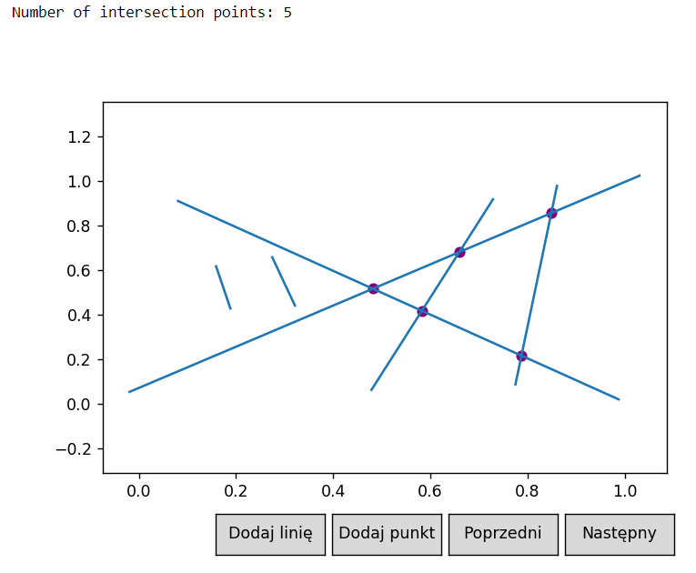

# Bentley-Ottmann
Bentley-Ottmann algorithm for computational geometry laboratories. It finds segments intersections.

What is interesting about this particular algorithm, is its time complexity, 
which is O((n + k) log(n)), where n is number of segments and k number of intersections.
For k = o(n^2 / log(n)) it is an improvement on a naive approach, which checks every pair of segments and has time complexity O(n^2).

## Rules
* No two line segment endpoints or crossings have the same x-coordinate (it is partially solved using truncated x coordinates as hash keys).
* No line segment endpoint lies upon another line segment.
* No three line segments intersect at a single point (hashing also takes care about this statement of original algorithm).

## Algorithm description

Let Q be the event structure (implemented as a priority queue)
Let T be the sweep state structure (implemented as enriched red-black tree)

<pre>
Add ending points of segments to event structure Q

<b>while</b> (there is event in Q)
  Let e be the first event in Q
  
  <b>if</b> (e is the starting point of the segment s)
    insert s to T, update T
    <b>if</b> (s has an upper heighbor s' in T, s intersects with s' in point p)
      insert p to Q if there is no p there
    <b>if</b> (s has a lower heighbor s'' in T, s intersects with s'' in point p)
      insert p to Q if there is no p there
      
  <b>if</b> (e is the ending point of the segment s)
    remove s from T, update T
    <b>if</b> (s has upper neighbor s' in T, s has a lower neighbor s'' in T, s' and s'' intersects in point p)
      insert p to Q if there is no p there
      
  <b>if</b> (e is the intersection point between segment u and d) u - for up, d - for down
    change order of u and d in T -- now u is down and d is up
    <b>if</b> (u had an upper neighbor s' in T, d intersects with d in point p)
      insert p to Q if there is no p there
    <b>if</b> (d had a lower noighbor s'' in T, u intersects with u in point p)
      insert p to Q if there is no p there
    
</pre>

Time complexity estimation:

There will be 2n + k = O(n + k) elements in event structure Q 

For every element in Q we have to:

* Take it from Q in O(log(n + k))
* Perform at most 3 operations on T, which all are O(log(n))
* Perform at most 2 operations on Q(inserts), which all are O(log(n + k))

k = O(n^2), so O(log(n + k)) = O(log(n + n^2)) = O(log(n))

Finally, taking into consideration previous results we have total time complexity of O((n + k) log(n)).

## Proof of correctness

## Visualization

### Checking if intersection exists

Algorithm for checking intersection existance works exactly the same way, yet state structure is just an ordinary list,
due to the lack of necessity of operating on the state structure.

### Finding all intersections

Results of algorithm on pictures below (sensible visualization too big for GIF).

<b>Custom input</b>

<b>Random input</b>

<b>Selected 3 segments with 3 intersection points</b>

<b>Loads of random segments</b>

